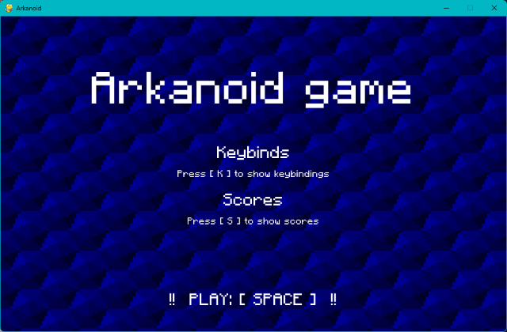
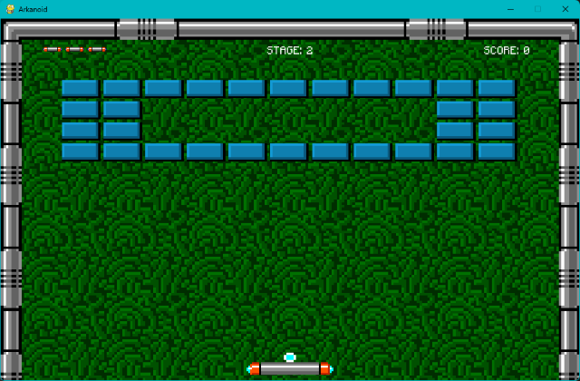
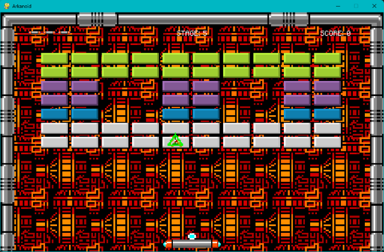

# Custom Arkanoid Game

## Description

Custom Arkanoid Game is a unique variation of the classic Arkanoid arcade game. The objective is to control a paddle and bounce a ball to break all the bricks on the screen. This customized version introduces several gameplay enhancements, including upgrades, enemies, and modified power-ups. The game is implemented in Python using the Pygame library.

## Features

- Control the paddle using the arrow keys to bounce the ball and destroy bricks.
- Break all the bricks on each level to progress to the next level.
- Collect power-ups to enhance gameplay:
    - Bigger Paddle: Increases the size of the paddle, making it easier to hit the ball.
    - Extra Life: Grants an additional life, allowing the player to continue playing after losing all lives.
    - Speed Boost: Increases the speed of the ball and paddle, adding an extra challenge.
- Encounter enemies that can hinder your progress or modify the gameplay dynamically.
- Score tracking and display.
- Lives counter.

## Screenshots

## Demo

A live demo of the game is not available currently.

## Installation

1. Clone the repository: `git clone https://github.com/your-username/arkanoid-game.git`
2. Navigate to the project directory: `cd arkanoid-game`
3. Install the required dependencies: `pip install -r requirements.txt`
4. Launch the game: `python main.py`
5. Use the arrow keys to move the paddle and bounce the ball.

## Resources

- Game sprites and assets: [The Spriters Resource](https://www.spriters-resource.com/arcade/arkanoid/)
- Background music: [Pixabay Music](https://pixabay.com/pl/music/)

## License

This project is licensed under the MIT License. See the [LICENSE](LICENSE) file for details.
